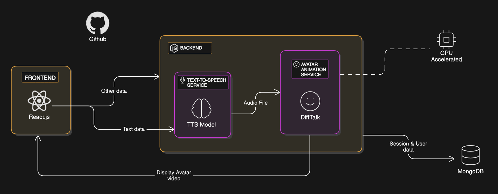
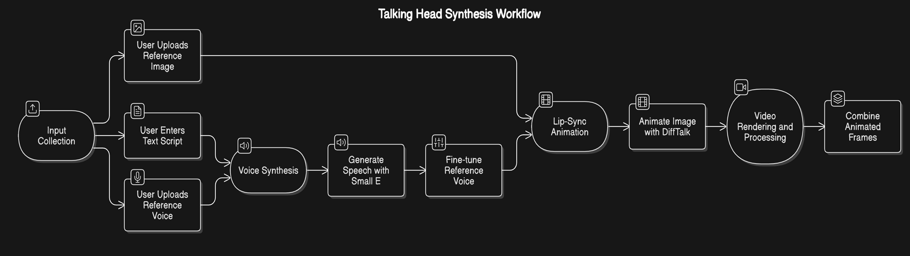

# AvatarLab-G362-PS25

**Bringing avatars to life with realistic talking head animations**

## 📌 Introduction

### Purpose of the Project
This Project brings avatars to life by creating realistic talking head animations that move naturally in sync with speech. By leveraging DiffTalk, it ensures smooth and accurate lip-syncing, while Small E provides high-quality, natural-sounding voice synthesis. This combination enables the creation of expressive, human-like digital characters.

### Applications of the Project
- **Virtual Assistants**: Make AI chatbots more expressive with animated faces.
- **E-Learning**: Create interactive teachers that can talk and explain concepts.
- **Content Creation**: Generate talking avatars for YouTube videos, marketing, and social media.
- **Gaming & Metaverse**: Add lifelike characters to games and virtual worlds.

## 📌 Architecture Diagram



## 📌 Workflow Diagram



## 📌 Demo

### Sample Outputs

[🎥 Anime Avatar Demo](./assets/anime.mp4)

[🎥 Virat Avatar Demo](./assets/virat.mp4)


## 📌 Research Paper Explanations

## DiffTalk
The DiffTalk model is a state-of-the-art deep learning framework designed for realistic talking head animation with high-quality lip-syncing. It utilizes diffusion models to generate smooth and natural lip movements that accurately align with speech audio.

#### Key Contributions:

- **Realistic Animations**
- **Works on Any Face**
- **Seamless Motion**
- **High-Quality Lip-Sync**

#### Methodology:

- **Input Processing**: Extracts speech features from the audio and prepares the avatar image.
- **Diffusion-Based Lip-Sync Generation**: Uses a diffusion model to generate precise lip movements.
- **Facial Expression and Motion Modeling**: Captures subtle expressions and head movements for realism.
- **Frame Rendering & Video Synthesis**: Applies the generated movements to the avatar and renders smooth frames.
- **Output: Realistic Talking Avatar**: Produces a high-quality animated avatar in sync with the given speech.

#### Results:
DiffTalk is a game-changer in talking head animation, using diffusion models to create realistic, expressive, and adaptable AI avatars.
It pushes the boundaries of natural-looking facial movements and lip-sync, making avatars feel more lifelike and engaging across different identities and voices.

## Small E

Small-E is a lightweight text-to-speech (TTS) model that creates natural voices and can instantly clone any voice.
Unlike traditional models that rely on heavy transformers, Small-E uses a more efficient Linear Causal Language Model (LCLM), making it faster, more resource-friendly, and capable of handling longer speech samples.

#### How It Works:
- **Text Processing**: Breaks down text into meaningful pieces using byte-pair encoding.
- **Audio Encoding**: Compresses speech using an RVQ (Residual Vector Quantization) codec to keep it high-quality yet lightweight.
- **Efficient Modeling**: Uses LCLM blocks for better efficiency instead of bulky transformers.
- **Smart Cross-Attention**: Aligns text and speech accurately to generate smooth, natural voices.

## 📌 Steps to Run

### 1. Setting up Text-To-Speech Model
Please refer to the detailed setup instructions in:
[Zonos](./backend/models/Zonos/README.md)

### 2. Setting up THS Voice Synthesis
For voice synthesis configuration and installation, see:
[AniTalker](./backend/models/AniTalker/README.md)

### 3. Running the Application

Once both models are set up, run the following commands in separate terminals:

```bash
# Terminal 1: Start the frontend
npm run dev
```

```bash
# Terminal 2: Start the backend server
nodemon server.js
```

```bash
# Terminal 3: Start the Python API
python api.py
```

## 📌 Conclusion:
Small-E proves that high-quality speech synthesis doesn't have to be resource-heavy. With its fast training, lightweight design, and impressive voice quality, it sets a new standard for efficient, scalable AI-generated speech.

## 📌 References

- [Zhang, Y., et al. (2023). "DiffTalk: Crafting Diffusion Models for Generalized Audio-Driven Portraits Animation."](https://openaccess.thecvf.com/content/CVPR2023/papers/Shen_DiffTalk_Crafting_Diffusion_Models_for_Generalized_Audio-Driven_Portraits_Animation_CVPR_2023_paper.pdf) *Computer Vision and Pattern Recognition (CVPR)*.
- [Small-E Team. (2023). "Small-E: Efficient Text-to-Speech Through Model Compression."](https://github.com/seznam/small-e-czech) *Proceedings of Speech Synthesis Workshop*.

## 📌 Team

- **Member 1**: [NUKALA SIRI CHANDANA KMIT](https://github.com/Pac-rgb)
- **Member 2**: [LOKINENI HINDHUJA KMIT](https://github.com/Hindhuja7/Hindhuja)
- **Member 3**: [MANTHINEEDI SANTHOSH SIDDARTHA KMIT](https://github.com/SantoshNecroville)
- **Member 4**: [PANNALA APUROOP REDDY KMIT](https://github.com/Appu-Reddy)
- **Member 5**: [PICHAPATI ADI ASWATHA REDDY KMIT](https://github.com/aswath-reddy)
- **Member 6**: [PANDIT VIVEK KUMAR](https://github.com/Vivek17290)
# 🚀 Project Milestones

## 📊 Team Progress Overview

| 👤 **Team Member** | 🎯 **Milestone 1** | 🎯 **Milestone 2** | 📋 **Presentation** |
|:-------------------|:-------------------:|:-------------------:|:--------------------:|
| **NUKALA SIRI CHANDANA** | [🎥 Watch](https://youtu.be/kk90nlDJyQY?si=3Ql4M1sTTovHFs-c) | [🎥 Watch](https://www.youtube.com/watch?v=2t-nBTw2Fcc) | [📊 View Slides](https://github.com/SantoshNecroville/AvataR/blob/main/docs/23BD1A0556.pptx) |
| **LOKINENI HINDHUJA** | [🎥 Watch](https://drive.google.com/file/d/188SJ_Cpvs_8Wvk_KrPtYrIbw2gC78pLA/view) | [🎥 Watch](https://www.youtube.com/watch?v=UWc4-Y4jeWs) | [📊 View Slides](https://github.com/SantoshNecroville/AvataR/blob/main/docs/23BD1A0545.pptx) |
| **MANTHINEEDI SANTHOSH SIDDARTHA** | [🎥 Watch](https://drive.google.com/file/d/1_TmtuXGoI8EVZurBlH3fJcrTQeeVRM_r/view) | [🎥 Watch](https://drive.google.com/file/d/1UDcQTDALLpqlKsEgK7nayIUD5wbyUIa8/view?usp=drive_link) | [📊 View Slides](https://github.com/SantoshNecroville/AvataR/blob/main/docs/23BD1A054F.pptx) |
| **PANNALA APUROOP REDDY** | [🎥 Watch](https://drive.google.com/file/d/1bWLRDonjn5ADakWeq5PQxw1fkmNfFcDZ/view?usp=sharing) | [🎥 Watch](https://drive.google.com/file/d/1qcyzXgg9yb62aj67TLSwAgN-uVXc5p7N/view?usp=sharing) | [📊 View Slides](https://github.com/SantoshNecroville/AvataR/blob/main/docs/23BD1A055C.pptx) |
| **PICHAPATI ADI ASWATHA REDDY** | [🎥 Watch](https://drive.google.com/file/d/1opIDj0n6hjS44Nzkb9LnAoHzQYy1zzDd/view?usp=drivesdk) | [🎥 Watch](https://drive.google.com/file/d/1KPTLMhZS00Z9sa3H2s1Ig5IGMtVYn2bH/view?usp=drive_link) | [📊 View Slides](https://github.com/SantoshNecroville/AvataR/blob/main/docs/23BD1A055N.pptx) |
| **PANDIT VIVEK KUMAR** | [🎥 Watch](https://drive.google.com/file/d/1lBQ5GtokwO0AP2CxaH64hYXeBdPa5yB0/view?usp=sharing) | [🎥 Watch](https://drive.google.com/file/d/1xUR7Xt43gZBFawfHQTG3rkJDJJaFpCBV/view?usp=drive_link) | [📊 View Slides](https://github.com/SantoshNecroville/AvataR/blob/main/docs/23BD1A055B.pptx) |

--- 

2025 AvatarLab Team | G362-PS25